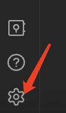
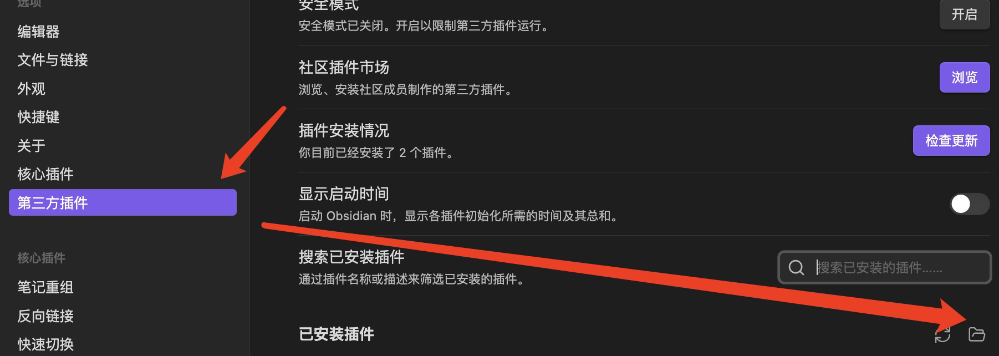
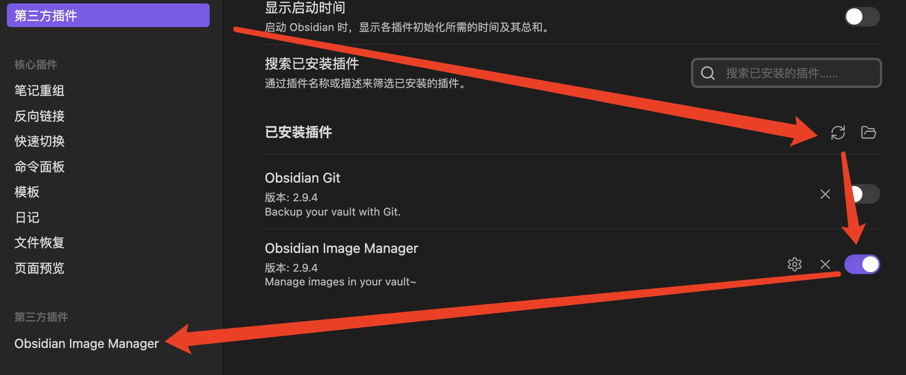

## 什么是 obsidian-image-manager？

这是一个用于管理图片的简单插件，目前具有如下功能：

- 一键收集 markdown 文档中引用到的图片（暂不支持链接），并聚集到某个目录下；
- 按图片名收集图片，用于在链接目录层级有误的情况下进行收集，目前仍在早期试验阶段；

接下来要开发的内容：

- 收集策略（Collect Strategy）的描述支持切换后动态更新；
- 插入图片后能够自动收集到根目录下；
- 一键检查重复的图片名；
- 配置选项保存和读取功能完善（现在没有生效）；
- 完善一些情况的错误处理，`console.log` 或者 `new Notice`。


## 如何用到我的 obsidian 中？
### 安装环境
1. 构建插件需要有 `Node.js` 环境，下载链接：[Node.js](https://nodejs.org/en/)；
2. 下载 `TypeScript` 语言环境，下载链接：[Typescript](https://www.typescriptlang.org/download)。
### 构建项目
第一次构建目录需要先安装 `Node` 依赖包，使用下面的命令一键安装：
``` powershell
npm install
```
在 `package.json` 中已经有构建命令，直接使用下面的命令进行构建：
``` powershell
npm run build
```
### 接入 obsidian
构建完成后，本地将多出一个 `build` 目录，首先进入配置面板：



进入第三方插件选项卡，然后点击文件夹图标打开第三方插件目录：



创建一个文件夹（建议叫 `obsidian-img-manager`），然后将 `manifest.json` 和 `build/main.js` 复制进去。这些操作完成后，刷新并重新加载插件：



之后就可以使用了。
### 使用方式
#### 设置策略
#### 文件或目录右键一键收集
