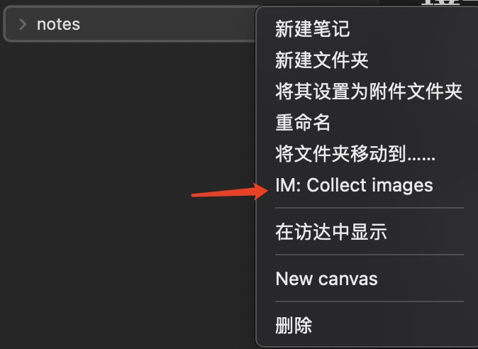

## 什么是 obsidian-image-collector？

这是一个用于管理图片的简单插件，是个人为了管理本地的一些图片开发的插件，目前具有如下功能：

- 一键收集 markdown 文档中引用到的图片，并聚集到某个目录下；
- 按图片名收集图片，用于在链接目录层级有误的情况下进行收集，目前仍在早期试验阶段；

目前不支持的特性：

- 不支持 wiki 语法；
- 网络图片不会进行处理；
- 按图片名搜集图片在有多个同名图片的情况下默认将第一个符合条件的图片作为目标图片；

适用于：

- 对图片仅有简单的管理需求，平时更多直接将图片粘贴到文本中，非目录式图片存储的使用者；
- 有备份笔记习惯的使用者；

不适用于：

- 多种类型图片链接，复杂目录结构，对笔记图片的存储有精细控制需求的使用者；
- 本地笔记，无备份的使用者；


## 如何用到我的 obsidian 中？
### 安装环境
1. 构建插件需要有 `Node.js` 环境，下载链接：[Node.js](https://nodejs.org/en/)；
2. 下载 `TypeScript` 语言环境，下载链接：[Typescript](https://www.typescriptlang.org/download)。
### 构建项目
第一次构建目录需要先安装 `Node` 依赖包，使用下面的命令一键安装：
``` powershell
npm install
```
在 `package.json` 中已经有构建命令，直接使用下面的命令进行构建：
``` powershell
npm run build
```
### 接入 obsidian
构建完成后，本地将多出一个 `build` 目录，首先进入配置面板：


进入第三方插件选项卡，然后点击文件夹图标打开第三方插件目录：


创建一个文件夹（建议叫 `obsidian-image-collector`），然后将 `manifest.json` 和 `build/main.js` 复制进去。这些操作完成后，刷新并重新加载插件：


之后就可以使用了。
### 使用方式
#### 设置策略

两种搜索策略：

- 精确搜索 `AccurateSearch`，直接按照链接文本里面的图片路径搜索，没有则不处理；
- 模糊搜索 `FileNameSearch`，按照链接文本里面的图片名字搜索根目录下所有文件，以第一个匹配的图片为目标；

一种转移图片策略：

- 按文件名转移 `FollowMarkdownFileName`，图片转移到目标目录下，直接按照 md 文件名重命名，重复名字将在后面按数字排列；

#### 文件或目录右键一键收集

如图，右键文件与右键目录均能点击这个选项：


